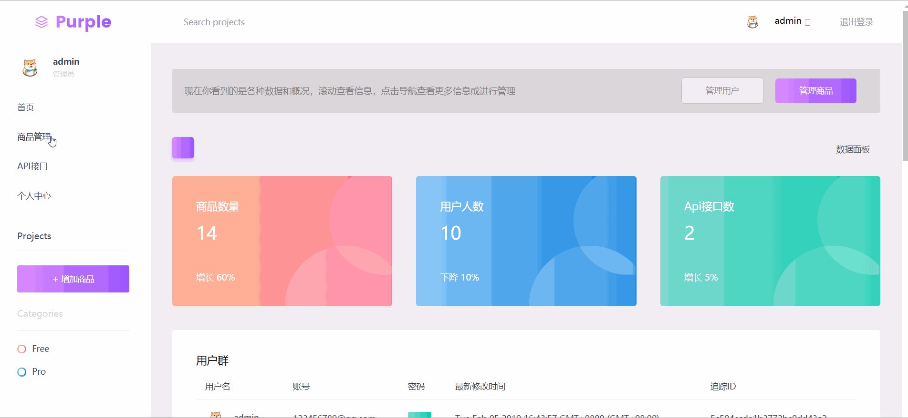

# management品牌管理系统
基于Koa2.js+MongoDB+ejs技术栈，独立开发MVC模式的三星手机品牌管理系统。

## 项目架构

项目分页|子页面|功能点
:---|:---:|:---:
首页|无|展示商品、注册用户数量等相关数据
商品管理页|商品详情页、新增商品页、更新商品页|展示商品信息，对商品进行分页、排序以及增删改查
Api接口|商品列表api|保留相关接口方便以后可扩展应用
个人中心|账号设置|查看、设置个人信息
登录、注册|无|注册、登录认证

## 页面功能展示
1. 首页展示

2. 商品管理页展示

3. 个人中心页展示

## 性能与安全
* 通过gzip压缩文件资源，传输加快，减少通信带宽；
* 设置响应首部字段通知客户端使用没过期的缓存，提高响应速度；
* 响应首部字段Set-Cookie设置HttpOnly，加以限制，使Cookie不能被JavaScript脚本访问，防止XSS攻击。

## 总结
快速开发出项目原型，实现基本基本功能，达到了了解后台开发机制，加深对前后端协作、工作流程的理解，完成了自己预期的目标。但是，项目中还存在一定不合理的地方以及问题，有待对其进行优化，需要长期维护更新。
